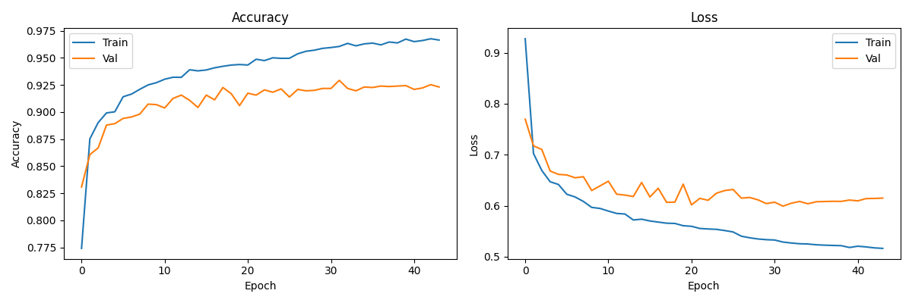
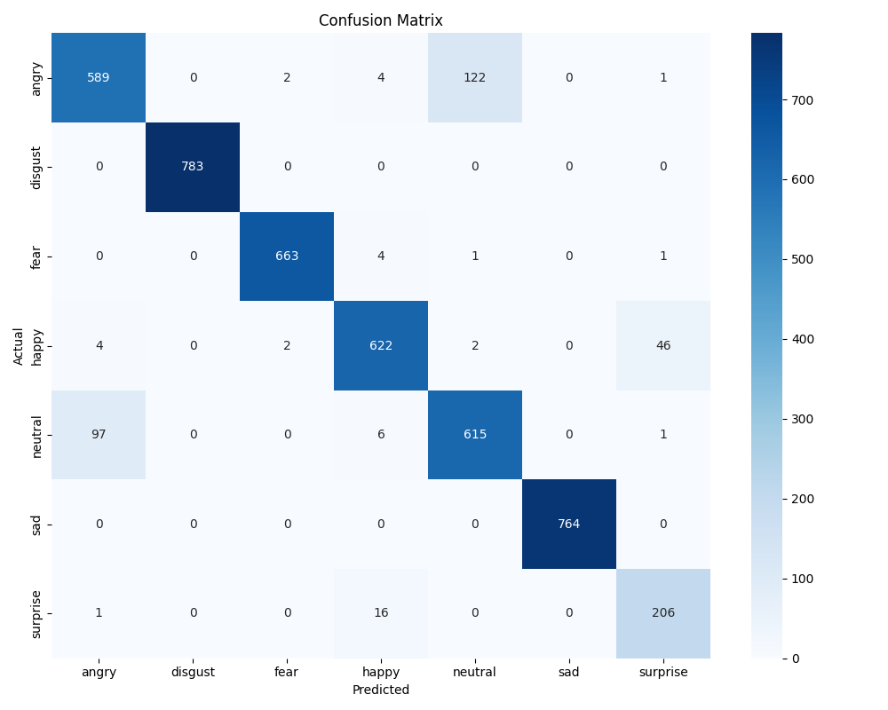

# Speech Emotion Recognition

A deep learning system that detects emotion from speech audio using a hybrid **CNN-BiLSTM** architecture with multi-head attention. Trained on four publicly available datasets, achieving **93% test accuracy** across 7 emotion classes.

## Results

| Emotion | Precision | Recall | F1 |
|---------|-----------|--------|----|
| angry | 0.85 | 0.82 | 0.84 |
| disgust | 1.00 | 1.00 | 1.00 |
| fear | 0.99 | 0.99 | 0.99 |
| happy | 0.95 | 0.92 | 0.94 |
| neutral | 0.83 | 0.86 | 0.84 |
| sad | 1.00 | 1.00 | 1.00 |
| surprise | 0.81 | 0.92 | 0.86 |
| **overall** | | | **0.93** |





The primary confusion is between **angry** and **neutral** (122 and 97 misclassifications respectively), which is consistent with findings across SER literature — both classes share similar low-energy prosodic patterns and the boundary is subjective even for human annotators. **Happy** is occasionally misclassified as **surprise** (46 cases), reflecting their overlapping acoustic profiles.

## Architecture

```
Input (100 timesteps × 82 features)
→ Conv1D(64)  → BatchNorm → MaxPool → Dropout
→ Conv1D(128) → BatchNorm → MaxPool → Dropout
→ BiLSTM(128, return_sequences=True) → Dropout
→ MultiHeadAttention(heads=4, key_dim=32) → Dropout
→ BiLSTM(64) → Dropout
→ Dense(7, softmax)
```

**Features per segment:** 40 MFCC + 40 Mel-spectrogram (dB) + ZCR + RMS energy  
**Regularization:** L2 on all learnable layers, Dropout(0.3), label smoothing(0.1)  
**Optimizer:** Adam (lr=3e-4) with ReduceLROnPlateau  
**Training:** Early stopping on val_loss, best weights restored automatically

## Datasets

| Dataset | Files | Language |
|---------|-------|----------|
| [RAVDESS](https://zenodo.org/record/1188976) | 1,440 | English |
| [CREMA-D](https://github.com/CheyneyComputerScience/CREMA-D) | 7,442 | English |
| [TESS](https://zenodo.org/record/1443284) | 2,800 | English |
| [SAVEE](https://www.kaggle.com/datasets/ejlok1/surrey-audiovisual-expressed-emotion-savee) | 480 | English |

All audio is resampled to 22,050 Hz and segmented into 2-second windows. Targeted augmentation (pitch shift, time stretch, background noise) is applied to underrepresented emotion classes.

## Setup

```bash
# Requires Python 3.12
python3.12 -m venv .venv
source .venv/bin/activate
pip install -r requirements.txt
```

## Download datasets

```bash
# Requires a Kaggle account — save API token to ~/.kaggle/access_token
python download.py
```

## Train

```bash
python train.py
```

Outputs to `checkpoints/`: `best_model.keras`, `label_encoder.pkl`, `scaler.pkl`, `confusion_matrix.png`, `training_curves.png`.

## Demo

```bash
python app.py
```

Opens a Gradio interface at `http://127.0.0.1:7860`. Record via microphone or upload a `.wav` file to get a prediction with per-emotion confidence scores.

## Predict a single file

```bash
python predict.py path/to/audio.wav --top 3
```

## Stack

Python · TensorFlow/Keras · librosa · scikit-learn · Gradio
